# Mission Spawn Flow

User describes a job in natural language. The AI Matchmaker scans the project to detect its tech stack, selects a mission type, then hands off to the Mission Resolver. The resolver reads the mission YAML for required capabilities, runs greedy set-cover to find the minimum class slots (starting with `lead`), and returns the slots. The Matchmaker then scans all crew YAMLs in the Character Roster, scores each eligible character by `overlap(character.skills, project.stack)`, picks the highest-scoring character per slot (tiebreaking toward same-crew), and validates full coverage. If all slots are filled, the party is spawned via `spawn_party`. If not, the user is prompted to select manually.

```mermaid
flowchart TD
    subgraph User
        U1([User: 'bugfix in this project'])
    end

    subgraph AI Matchmaker
        A1[Scan project files<br/>pyproject.toml, package.json,<br/>Cargo.toml, Dockerfile, etc.]
        A2[Detect tech stack tags<br/>e.g. python, react, docker]
        A3[Pick mission type<br/>from user request]
        A7[Score characters per slot<br/>overlap&#40;character.skills, project.stack&#41;]
        A8[Pick highest-scoring character<br/>per slot — tiebreak same-crew]
        A9{All capability<br/>slots covered?}
    end

    subgraph Mission Resolver
        M1[Read mission YAML<br/>e.g. missions/bugfix.yaml]
        M2[Extract required capabilities<br/>manage, investigate, code, test, review]
        M3[Greedy set-cover:<br/>start with lead &#40;manage&#41;,<br/>pick class covering most remaining]
        M4[Return minimum class slots<br/>e.g. lead + builder + recon]
    end

    subgraph Character Roster
        C1[(Crew YAMLs<br/>crews/*.yaml)]
        C2[Filter characters matching<br/>each slot's class]
    end

    subgraph Spawn System
        S1[Pull system prompts<br/>from crew YAMLs]
        S2[spawn_party&#40;&#41;]
    end

    U1 --> A1
    A1 --> A2
    A2 --> A3
    A3 --> M1
    M1 --> M2
    M2 --> M3
    M3 --> M4
    M4 --> C1
    C1 --> C2
    C2 --> A7
    A7 --> A8
    A8 --> A9
    A9 -- Yes --> S1
    S1 --> S2
    A9 -- No --> U_MANUAL([Suggest manual selection])
```

